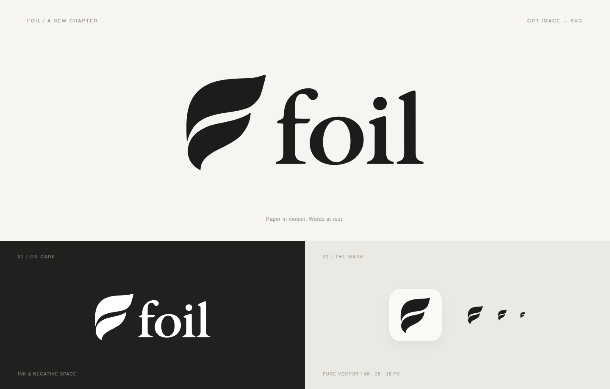

# Foil identity

Two flowing page shapes form a subtle **f**, paired with a lowercase serif wordmark. The monochrome design uses ink and negative space to suggest paper and writing.

## Assets

| Asset | Use |
| --- | --- |
| [Full logo](../../packages/editor/src/assets/brand/foil-logo.svg) | Light backgrounds; transparent SVG |
| [Reversed logo](../../packages/editor/src/assets/brand/foil-logo-dark.svg) | Dark backgrounds; transparent SVG |
| [Page mark](../../packages/editor/src/assets/brand/foil-mark.svg) | App icon or avatar |
| [Monochrome mark](../../packages/editor/src/assets/brand/foil-mark-mono.svg) | Inherits `currentColor` when embedded inline |
| [Favicon](../../packages/editor/src/assets/brand/foil-favicon.svg) | Adapts to the browser's light/dark color scheme |
| [Logo PNG](foil-logo.png) | Transparent, 1056 × 459 |
| [Icon PNG](foil-mark.png) | Transparent, 512 × 512 |
| [Extension icons](../../apps/extension/public/icons/) | 16/32/48/128 px PNGs of the existing mark on a pale rounded backing |

Use the icon at 16 px or larger and the full logo at 74 px or larger. Preserve the aspect ratio and viewBox padding. The default artwork is `#1c1c1c`; use the white version on dark backgrounds. The app's logo follows its reading theme through `currentColor`.

## Source and conversion

The design was generated with Codex's built-in GPT Image tool. The [original PNG](gpt-image/original.png) and [exact prompt](gpt-image/prompt.md) are preserved. GPT Image outputs raster images; these SVGs were created afterward by tracing the generated silhouette.

Conversion used the PNG's alpha channel at a threshold of 128 and VTracer 0.6.15: binary mode, spline curves, speckle filter 12, corner threshold 65, length threshold 3.5, 10 iterations, splice threshold 45, and path precision 2. The mark contains two paths; the full logo contains seven. The SVG artwork contains no embedded bitmap, external font, or linked resource.

The shared [Brand component](../../packages/editor/src/components/Brand.tsx) renders the [vector geometry](../../packages/editor/src/assets/brand/geometry.ts) in the editor and reader. The favicon is embedded as a data URL in exported HTML. Keep the geometry, SVGs, and PNG exports in sync when changing the artwork.

The extension icons reuse the original mark geometry. Reproduce them with `bun run --cwd apps/extension icons`; its [conversion helper](../../apps/extension/scripts/icons.ts) uses pinned Playwright Chromium and writes an ignored light/dark preview to `apps/extension/artifacts/icon-preview.png`.
